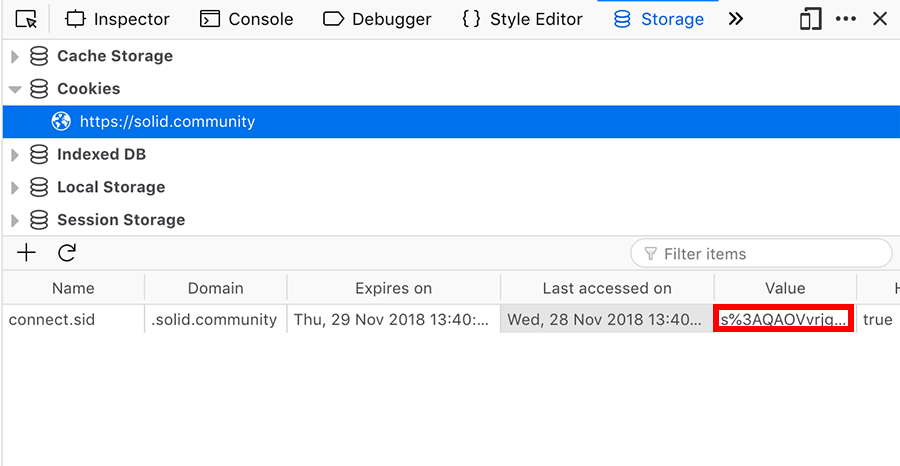
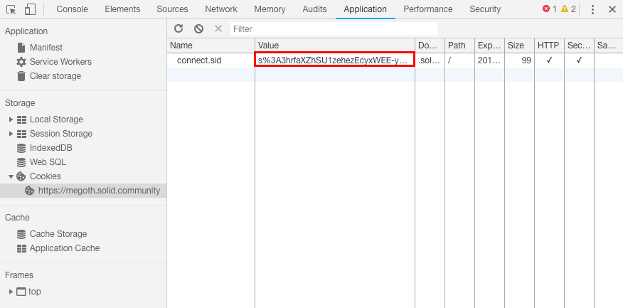

# How to update your front page of your Solid POD and signal that it shouldn't be overwritten by your POD provider

Your Solid POD contains a `index.html` file that acts as the front page of your POD. The rule is that only you can control it, but that makes it difficult for POD providers to update it as new functionality becomes available. We expect most people to want this updates, but want to respect those who wants to customize their front page fully without it being overwritten by later updates from the POD provider, so we have created an opt-out mechanism for the automatic update. (This can later be changed back to automatic update if you change your mind.)

This tutorial requires use of `curl`, so if you're not familiar with Command Line Interface, you might want to learn a little about that first ([UNIX](https://www.learnenough.com/command-line-tutorial), [OSX](https://blog.teamtreehouse.com/introduction-to-the-mac-os-x-command-line), [Windows](https://www.digitaltrends.com/computing/how-to-use-command-prompt/). If you're using Windows, you might also need [curl for Windows](https://curl.haxx.se/windows/). You also need to access developer tools in your browser, and if you're unfamiliar with this, [you might want check out this tutorial](https://www.codementor.io/learn-development/javascript-css-html-tutorial-front-end-development-tools)).

There is a [TL;DR version of this tutorial](./TLDR.md) if you want the bare-bone version.

## Get cookie value

The easiest way to using `curl` with your POD is to set a cookie value for `connect.sid` that the POD server uses to authenticate you. To get ahold of this value, log in with your WebID in the browser, open your developer tools and find your cookies for the POD server you're logged into.

If you're on Firefox, you'll find this in the `Storage`-tab in the Firefox Developer Tools.



If you're on Chrome, you'll find the cookie in the `Application`tab in Chrome Developer Tools.



This value will be referred to as `<your-cookie-value>` going forward, and you need in the `curl` commands.

## (Optional) Download your current front page

Now, you can upload whatever `index.html` file you want, but if you want to start with the current front page you might want to download it from your POD. In your terminal, navigate to a directory you want to do your changes, and run the following:

```
curl --cookie "connect.sid=<your-cookie-value>" https://<your-pod>/index.html > index.html
```

`<your-pod>` refers to your POD on your local POD provider, e.g. `megoth.solid.community`.

This will download a local copy of your front page and name it `index.html`.

## Add/change value for solid-allow-automatic-updates

You can do whatever changes you want on `index.html`, prepare your own file from scratch, or build something using whatever tools you're familiar with. But if you want to link to resources from it, you might want to consider uploading this resources to the `public` space of you POD, to ensure that others get access to them.

To ensure that your POD provider don't overwrite your changes on an automatic update, we've devised a HTML-tag that you can use to signal that you want your front page to be preserved. It's a meta-tag with name `solid-allow-automatic-updates`, and to disable automatic updates your insert the following in your head-tag:

```
<meta name="solid-allow-automatic-updates" content="false">
```

In case you've downloaded a newer version of `index.html`, meaning that the tag is already set but with the default value of `true`, you can just change it to `false`, and you're all set.

**Note:** `index.html` is the only file that your POD provider are going to automatically update from time to time. You don't need to add this meta-tag to other HTML files in your POD.

## Upload your front page

When you're ready to upload your new front page, you can run the following:

```
curl --cookie "connect.sid=<your-cookie-value>" --upload-file index.html https://<your-pod>/index.html
```

(If it has gone some time since you downloaded and changed your file, your cookie value might not be valid anymore. In that case you want to reauthenticate on your POD server and get the new cookie value.)

Now your new front page should be uploaded, and to verify this you can visit your POD. There are no limitations to the changes you can do to the front page (well, as long as it doesn't break the T&Cs that your POD provider might have), so go wild if you want.


If you want to enable automatic updates of your front page at a later point, change the value of `solid-allow-automatic-updates` back to true, or remove the meta-tag altogether. It will not be updated until your POD provider runs the `updateindex` script though, so you might want to prompt them to do that if it's important for you to get the update as soon as possible.
